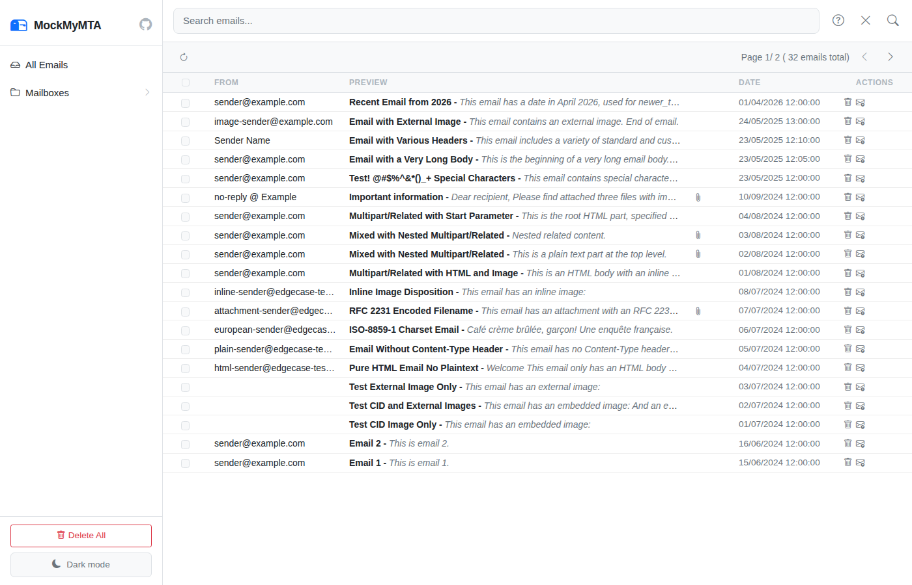
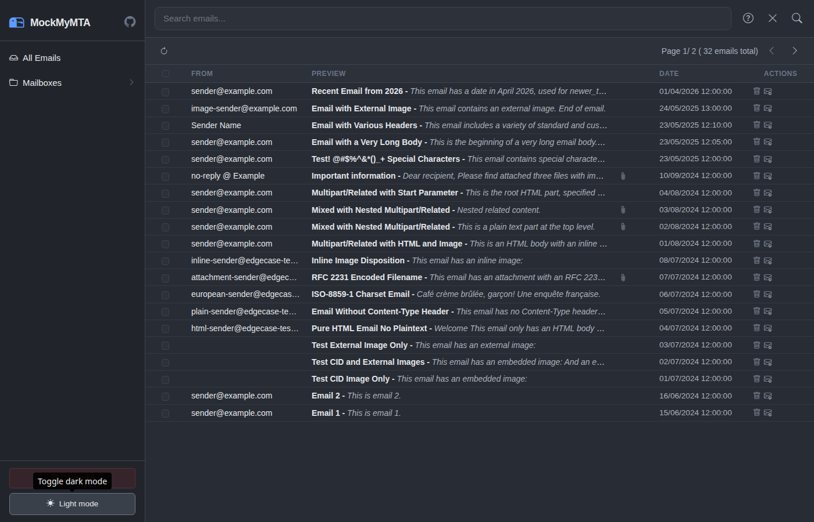
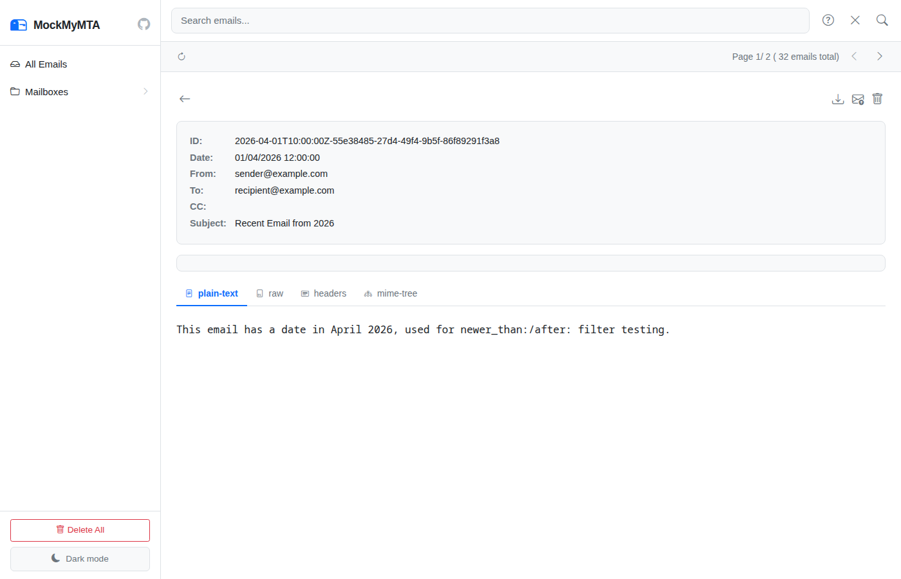

# MockMyMTA

[](https://github.com/yoda-jm/mock-my-mta/actions/workflows/build.yml)
[](https://github.com/yoda-jm/mock-my-mta/actions/workflows/e2e.yml)
[](https://hub.docker.com/r/vincentleligeour/mock-my-mta)
[](LICENSE)

A lightweight, local SMTP mock server for capturing and inspecting emails during development and testing — without sending anything to the outside world.



## Why?

When building software that sends emails (transactional, notifications, marketing), you need a way to:

- **Capture emails locally** instead of spamming real inboxes during development
- **Inspect email content** — headers, HTML/text bodies, attachments, MIME structure
- **Test your email pipeline** end-to-end with tools like Playwright, Cypress, or any test framework
- **Avoid external dependencies** — no SaaS account, no cloud service, just a local binary

MockMyMTA is a single Go binary that runs an SMTP server on port 1025 and a web UI on port 8025. Point your app's SMTP config at `localhost:1025` and every email it sends is captured, stored, and available for browsing.

## Features

### SMTP Server
- **STARTTLS** with auto-generated self-signed certificate (no files to manage)
- **SMTP AUTH** (PLAIN/LOGIN) — accepts any credentials (it's a mock)
- **Relay/forward** captured emails to a real SMTP server
- **Auto-relay** for automatic forwarding configurations

### Web UI
- **Dark mode** with system preference detection
- **Gmail-like search** syntax: `from:`, `subject:`, `has:attachment`, `before:`, `after:`, `older_than:`, `newer_than:`, quoted phrases
- **Body version tabs** — HTML, plain-text, raw, watch-html (Apple Watch)
- **Raw email headers** view
- **MIME structure tree** with inline preview for CID images
- **Attachment list** with download links
- **.eml file download** for any captured email
- **Bulk select/delete/relay** with confirmation dialogs
- **External images toggle** (hidden by default for safety)
- **Search autocomplete** with Tab completion
- **Real-time notifications** via WebSocket (instant updates when emails arrive)



### Email View



### API
- Full REST API for all operations
- `GET /api/health` — health check endpoint
- `GET /api/emails/{id}/headers` — all decoded headers
- `GET /api/emails/{id}/download` — raw .eml download
- `GET /api/emails/{id}/mime-tree` — MIME structure
- `GET /api/emails/wait?query=...&timeout=30s` — **wait-for-email** (long-poll until match)
- `GET /api/stats` — email count, uptime, server info
- `GET /api/health` — health check
- `GET /api/ws` — WebSocket for real-time events
- Bulk delete/relay endpoints
- XSS-safe HTML body serving (bluemonday sanitization)
- **Deep link URLs** — shareable hash-based URLs for searches, emails, and tabs

### Storage
- **Multi-layer, scope-routed architecture** ([design doc](docs/storage-layer-design.md))
- **Memory layer** — parsed email cache, O(1) reads
- **SQLite layer** — indexed metadata, persistent, pure Go
- **Filesystem layer** — raw .eml archive, source of truth
- Configurable per-operation routing (read, search, write, raw, cache)

### Testing
- **55 Playwright e2e tests** with screenshots in the report
- **90+ Go unit tests** across 9 test files
- Docker-based test execution
- GitHub Actions CI with Playwright report deployed to GitHub Pages

## Quick Start

### Docker (recommended)

```bash
docker compose up server -d
# SMTP: localhost:1025
# Web UI: http://localhost:8025
```

### From source

```bash
git clone https://github.com/yoda-jm/mock-my-mta.git
cd mock-my-mta
go build -o server ./cmd/server/
./server
```

### With test data

```bash
./server --init-with-test-data e2e/testdata/emails
```

### Configuration

Configure your application's SMTP settings:
- **SMTP host:** `localhost`
- **SMTP port:** `1025`
- **TLS:** STARTTLS available (optional)
- **Authentication:** Any username/password accepted (optional)

Then open http://localhost:8025 to browse captured emails.

## Use Cases

### Development
Point your app's SMTP config at `localhost:1025` during local development. Every email your app sends appears instantly in the web UI.

### E2E Testing with Playwright
```javascript
// Wait for an email to arrive (no sleep needed!):
const result = await inbox.waitForEmail('subject:Welcome', '30s');
expect(result.email.subject).toContain('Welcome');
expect(result.total_matches).toBe(1);

// Navigate directly to view it:
await inbox.gotoEmail(result.email.id);

// Or use the REST API directly:
const resp = await fetch('http://localhost:8025/api/emails/wait?query=subject:Welcome&timeout=30s');
const data = await resp.json();
console.log(data.url); // http://localhost:8025/#/email/2024-...
```

### CI/CD Pipeline
Add MockMyMTA as a service in your CI pipeline. Use the **wait-for-email API** to block until expected emails arrive — no `sleep()` needed.

```bash
# Wait up to 30s for the welcome email, get its URL:
curl -s "http://localhost:8025/api/emails/wait?query=subject:Welcome&timeout=30s" | jq .url
```

### QA Testing
QA team can inspect captured emails in the web UI — check HTML rendering, verify links, download attachments — without any email actually being delivered.

### Email Template Development
Send test emails and immediately see how they render in the web UI. Toggle external images, switch between HTML/text versions, inspect the MIME tree.

## Configuration File

Default configuration is embedded in the binary. Override with `--config config.json`:

```json
{
  "smtpd": {
    "addr": ":1025",
    "relays": {
      "production": {
        "enabled": false,
        "auto-relay": false,
        "addr": "smtp.example.com:587",
        "username": "",
        "password": "",
        "mechanism": "PLAIN"
      }
    }
  },
  "httpd": {
    "addr": ":8025",
    "debug": false
  },
  "storages": [
    { "type": "MEMORY", "scope": ["read", "cache"] },
    { "type": "FILESYSTEM", "scope": ["all"], "parameters": { "folder": "data", "type": "eml" } }
  ],
  "logging": { "level": "INFO" }
}
```

## Search Syntax

| Command | Example | Description |
|---------|---------|-------------|
| `from:` | `from:alice@example.com` | Emails from a specific sender |
| `subject:` | `subject:"weekly report"` | Subject contains text |
| `has:attachment` | `has:attachment` | Emails with attachments |
| `before:` | `before:2024-01-01` | Emails before a date |
| `after:` | `after:2024-06-01` | Emails after a date |
| `older_than:` | `older_than:7d` | Older than duration (d, w, m, y) |
| `newer_than:` | `newer_than:1h` | Newer than duration |
| `mailbox:` | `mailbox:user@test.com` | Emails to a specific recipient |
| (free text) | `"invoice ready"` | Search body, subject, addresses |

Filters can be combined: `from:alice@test.com has:attachment after:2024-01-01`

## Running Tests

### Go unit tests
```bash
go test ./... -v
```

### E2E tests with Docker
```bash
npm run docker:test
npm run report:serve  # view interactive HTML report
```

### E2E tests locally
```bash
npm ci && npx playwright install chromium --with-deps
./server --init-with-test-data e2e/testdata/emails &
npx playwright test
```

## Architecture

- [Storage Layer Design](docs/storage-layer-design.md) — multi-layer, scope-routed cascade
- [Improvement Plan](IMPROVEMENTS.md) — roadmap and status tracker

## Contributing

Contributions welcome! When modifying the UI, please:
- Use `data-testid` attributes on interactive elements
- Run `npm run docker:test` to verify e2e tests pass
- Follow existing commit message conventions

## License

[MIT License](LICENSE)

## Authors

- Vincent Le Ligeour ([@yoda-jm](https://github.com/yoda-jm))
